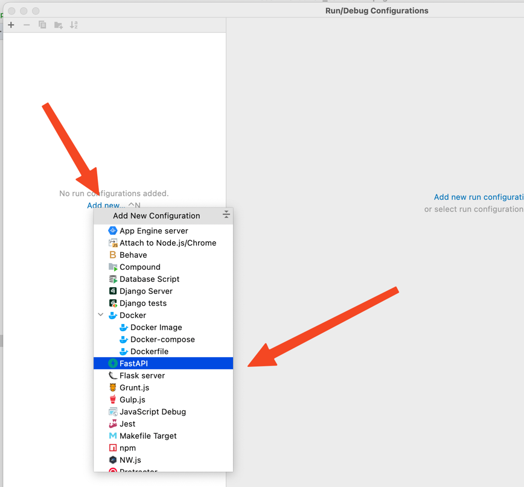

# Debugging in Pycharm

If you would like to debug application using in Pycharm and Docker Compose:

1. Add DockerCompose as python interpreter

use `python` service in interpreter settings

2. Add FastAPI as new configuration

* in field `Application file` choose `app/main.py file`,
* for `uvicorn options` use `--host 0.0.0.0 --port 8010 --reload`
* for `interpreter` choose remote interpreter added on previous step

3. Use button with a bug in left over for running server in debugging mode.

